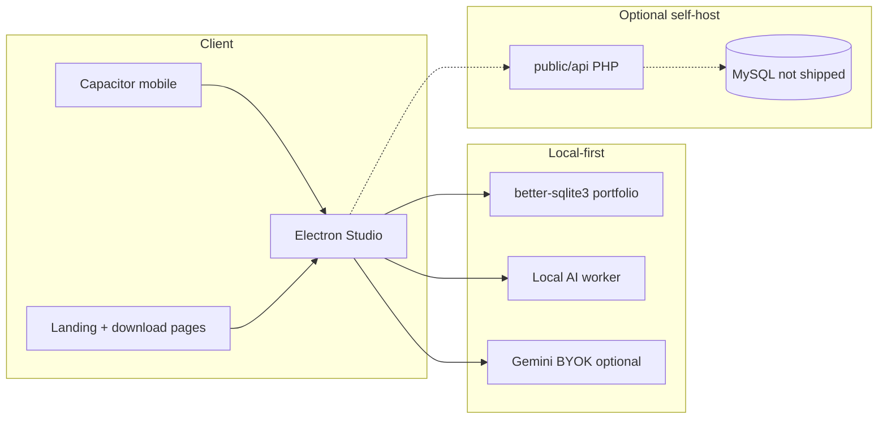

<div align="center">

# RawGraded Studio

**Local-first TCG pre-grading — capture, center, forensics, AI evidence passes, deterministic grade math, certificates, and portfolio tracking.**

[](LICENSE)
[](https://www.electronjs.org/)
[](https://react.dev/)
[](https://capacitorjs.com/)
[](https://github.com/GatoGodMode)

[rawgraded.com](https://rawgraded.com) · **Redacted public showcase** — full source, no databases, credentials, or operator keys

</div>

---

## Why this exists

Submitting a card to PSA/BGS/CGC costs real money with weeks of turnaround. RawGraded Studio lets collectors **pre-grade on their own machine** — guided capture, PSA-style centering, optional multi-stage video forensics, local or BYOK cloud AI, and deterministic grade math before paying submission fees.

This repository is a **curated, redacted release** of the production monorepo: desktop Electron app, Capacitor mobile companion, RAW ENGINE marketing site, and optional hosted PHP vault API. **MySQL dumps, Stripe keys, Gemini keys, signing certs, and production config are not included.**

**Created by:** [Joseph Edwards (@GatoGodMode)](https://github.com/GatoGodMode) · MIT licensed

---

## Core capabilities

| Layer | What it does |
|---|---|
| **Desktop Studio** | Electron + React grading workflow: crop, centering, forensics video, AI passes, certificates, portfolio |
| **Mobile companion** | Capacitor Android capture app synced to desktop workflow |
| **Local AI** | Ollama worker scripts + optional Gemini BYOK (`GEMINI_API_KEY` in `.env.local`) |
| **Grade math** | Deterministic engine — evidence → computed grades, not LLM-only guesses |
| **Hosted vault (optional)** | PHP API: auth, membership, archive, plugins, Stripe hooks — operator self-hosts MySQL |
| **Landing / downloads** | RAW ENGINE marketing site, studio download pages, legal/privacy |

---

## Architecture



---

## Quick start — desktop dev

**Requirements:** Node.js 18+, Windows recommended for Electron desktop path

```powershell
git clone https://github.com/GatoGodMode/RawGraded.git
cd RawGraded
copy .env.example .env.local
# Set GEMINI_API_KEY and VITE_GOOGLE_CLIENT_ID in .env.local (optional for local-only)
.\Launch-RawGraded.ps1
```

Or manually:

```bash
npm install
npm run dev:desktop
```

Open the Electron window when Vite is ready on `http://127.0.0.1:3000/app-desktop.html`.

**Build electron shell only:** `npm run build:electron-ts`  
**Vite web build:** `npm run build:vite-only`  
**Full signed installer:** requires code-signing certs (not in repo) — `npm run build:desktop`

---

## Optional PHP API self-host

1. Copy `public/api/config.example.php` → `public/api/config.php`
2. Fill in MySQL credentials, marketplace DB (if used), and `GOOGLE_CLIENT_ID`
3. Run migrations via `public/api/sync_db.php` on your server
4. Stripe/Gemini keys are stored in the **settings table at runtime** — never committed

---

## Redaction notice

This showcase excludes:

- Production `config.php`, `.env*`, signing certs (`.pfx`), SQLite/MySQL dumps
- Build artifacts (`dist/`, `release-build/`, `node_modules/`)
- Internal backup folders and dev-only DB probe scripts

Run before every publish:

```bash
npm run preflight
```

---

## Related RAW ENGINE products

Build scripts reference **Raw Investor** and **RawMarkets** sibling repos — those products build from separate codebases (`PriceChartingGradeRisk` locally). This repo ships RawGraded Studio source in full.

---

## License

MIT — see [LICENSE](LICENSE).
