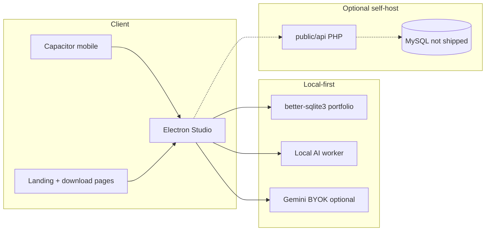
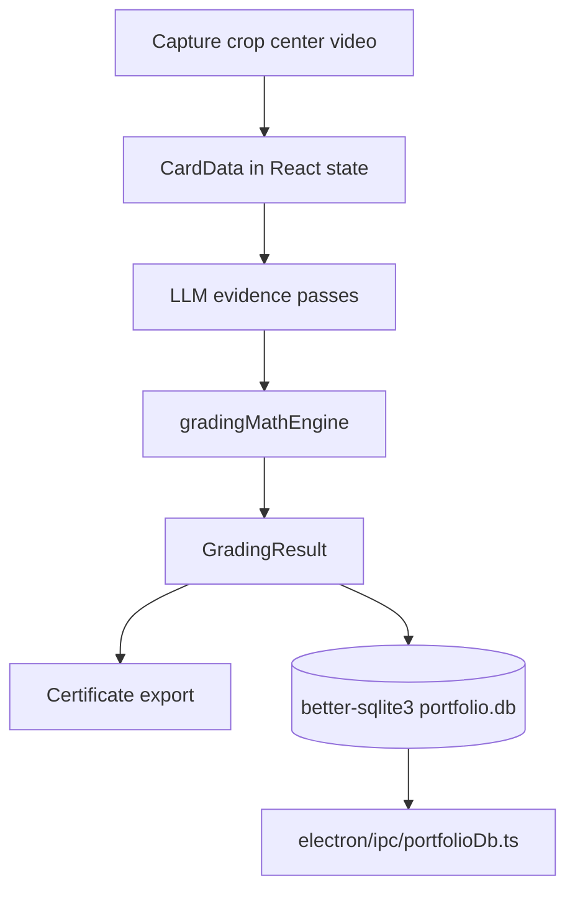
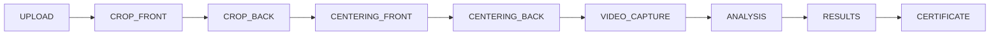
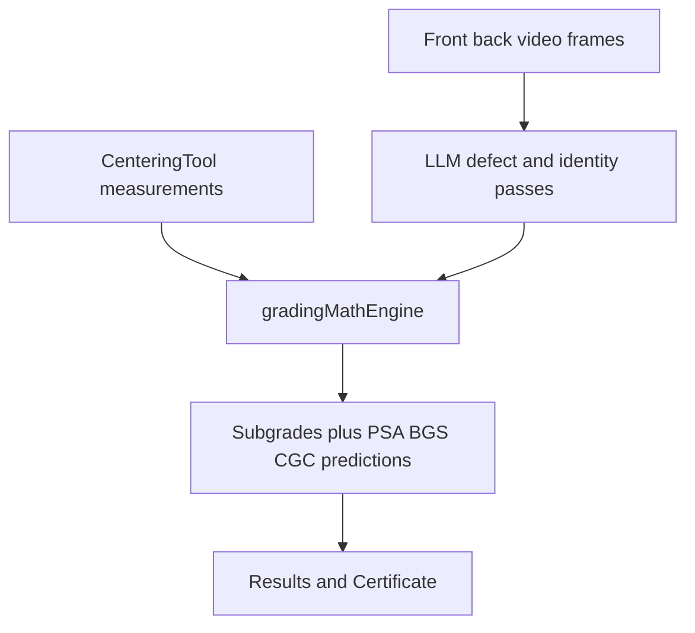

<div align="center">

# RawGraded Studio

**Local-first TCG pre-grading — capture, center, forensics, AI evidence passes, deterministic grade math, certificates, and portfolio tracking.**

[](LICENSE)
[](https://www.electronjs.org/)
[](https://react.dev/)
[](https://capacitorjs.com/)
[](https://github.com/GatoGodMode)

[rawgraded.com](https://rawgraded.com) · **Redacted public showcase** — full source, no databases, credentials, or operator keys

</div>

---

## Why this exists

Submitting a card to PSA/BGS/CGC costs real money with weeks of turnaround. RawGraded Studio lets collectors **pre-grade on their own machine** — guided capture, PSA-style centering, optional multi-stage video forensics, local or BYOK cloud AI, and deterministic grade math before paying submission fees.

This repository is a **curated, redacted release** of the production monorepo: desktop Electron app, Capacitor mobile companion, RAW ENGINE marketing site, and optional hosted PHP vault API. **MySQL dumps, Stripe keys, Gemini keys, signing certs, and production config are not included.**

**Created by:** [Joseph Edwards (@GatoGodMode)](https://github.com/GatoGodMode) · MIT licensed

---

## Core capabilities

| Layer | What it does |
|---|---|
| **Desktop Studio** | Electron + React grading workflow: crop, centering, forensics video, AI passes, certificates, portfolio |
| **Mobile companion** | Capacitor Android capture app synced to desktop workflow |
| **Local AI** | Ollama worker scripts + optional Gemini BYOK (`GEMINI_API_KEY` in `.env.local`) |
| **Grade math** | Deterministic engine — evidence → computed grades, not LLM-only guesses |
| **Hosted vault (optional)** | PHP API: auth, membership, archive, plugins, Stripe hooks — operator self-hosts MySQL |
| **Landing / downloads** | RAW ENGINE marketing site, studio download pages, legal/privacy |

---

## Architecture



---

## Repository structure

| Path | Role |
|---|---|
| [`desktop/StudioApp.tsx`](desktop/StudioApp.tsx) | Desktop grading wizard — step machine from capture through certificate |
| [`desktop/PortfolioApp.tsx`](desktop/PortfolioApp.tsx) | Local portfolio browser, re-analysis, PriceCharting identity refresh |
| [`electron/`](electron/) | Main process, preload bridge, SQLite portfolio IPC (`portfolioDb.ts`), pricing scrapers |
| [`components/`](components/) | React UI — capture, centering, video forensics, vault plugins, certificates |
| [`services/grading/`](services/grading/) | Deterministic grade math, centering assessment, defect consistency, identity guards |
| [`services/llm/`](services/llm/) | Provider abstraction — Gemini BYOK vs local Ollama (`gradingOrchestrator.ts`) |
| [`services/geminiService.ts`](services/geminiService.ts) | Multi-phase vision prompts, defect extraction, identity pipeline |
| [`public/api/`](public/api/) | Optional hosted PHP vault — auth, certificates, credits, Stripe, plugins |
| [`EnVars/SysMap.xml`](EnVars/SysMap.xml) | Structural map for this showcase repo |

---

## How data works

RawGraded uses **two storage tiers**: local-first desktop data stays on the user's machine; optional cloud vault syncs certificates when the user signs in.

### Desktop (local-first)



- **Portfolio DB:** `%AppData%/studio-portfolio/portfolio.db` (Electron `userData`) — WAL-mode SQLite with indexed `cards` rows and JSON payloads ([`electron/ipc/portfolioDb.ts`](electron/ipc/portfolioDb.ts)).
- **Settings:** `electron-store` for LLM provider choice, API keys (Gemini BYOK), and desktop preferences — never committed to git.
- **Images:** Base64/data URLs in session during grading; exported to certificate/social targets via [`services/export/`](services/export/).
- **No account required:** Full desktop grading path works offline from capture through local AI; cloud vault is optional.

### Hosted vault (optional PHP + MySQL)

When connected to [rawgraded.com](https://rawgraded.com) or a self-hosted copy:

| Store | Contents |
|---|---|
| **Primary DB** (`rawgraded`) | `users`, `certificates`, `scan_drafts`, `ai_jobs`, `settings`, Stripe/membership tables |
| **Marketplace DB** (`marketplace`) | External listing bridge for appraise/list plugins — separate credentials via `MARKETPLACE_DB_*` in config |
| **Runtime secrets** | Gemini, Stripe, CardHedger keys live in `settings` table — set via admin dashboard, not source code |

**Credit model (hosted):**

- Free users: AI jobs enqueue in `ai_jobs`; client polls until complete.
- Pro credits: bypass queue, save drafts to `scan_drafts`, up to 3 re-assessments; credit consumed on certificate issue ([`public/api/save.php`](public/api/save.php), [`public/api/ai.php`](public/api/ai.php)).
- Stripe checkout adds paid credits via [`public/api/stripe.php`](public/api/stripe.php) webhook fulfillment.

**Certificate lifecycle:** graded row in `certificates` with vault copy numbering, merge chains (`parent_id`), acquisition/valuation fields, optional public archive flag. Vault plugin endpoints live under [`public/api/`](public/api/) (e.g. merge, chain, appraise, vault numbering).

---

## Security model

Security is layered: **local privacy by default**, **operator-supplied secrets** for hosted mode, and **session-scoped API access** when vault features are used.

### Local / desktop

| Control | Implementation |
|---|---|
| **Data residency** | Card images and portfolio DB stay on-device; Ollama runs loopback-only |
| **BYOK cloud AI** | Gemini key from `.env.local` or in-app settings — never bundled in Vite `define` |
| **IPC boundary** | Electron preload exposes scoped APIs; main process owns filesystem and SQLite |
| **Publish guard** | [`scripts/publish-preflight.cjs`](scripts/publish-preflight.cjs) blocks credentials, `.pfx`, DB dumps, and production hostnames before git push |

### Hosted API ([`public/api/`](public/api/))

| Control | Implementation |
|---|---|
| **Config isolation** | [`config.example.php`](public/api/config.example.php) only in repo; real `config.php` gitignored |
| **Password storage** | `password_hash()` / `password_verify()` — bcrypt for users and admins ([`auth.php`](public/api/auth.php)) |
| **Session auth** | PHP sessions + `requireAuth()` / `requireAdmin()` on mutating endpoints and secret reads ([`db.php`](public/api/db.php), [`settings.php`](public/api/settings.php)) |
| **Third-party keys** | Loaded from settings table only ([`settings_util.php`](public/api/settings_util.php)) — no hardcoded fallbacks in plugin or market code |
| **TOTP 2FA** | Optional admin/user TOTP with HMAC-signed HttpOnly cookies, remember tokens in DB, 30-day re-prompt ([`totp_helper.php`](public/api/totp_helper.php)) |
| **CORS allowlist** | Origin restricted to rawgraded.com and localhost dev ports ([`db.php`](public/api/db.php)) |
| **Marketplace isolation** | Second DB connection via `openMarketplaceConnection()` — no inline credentials in plugin code |
| **Ownership checks** | Certificate mutations verify `user_id` match or admin role before list/merge/archive |
| **Stripe webhooks** | HMAC signature verified via [`stripe_webhook_util.php`](public/api/stripe_webhook_util.php) before fulfillment |

### What this showcase does **not** ship

Production MySQL dumps, live `config.php`, signing certs, hardcoded third-party API keys, or real training case JSON. Operators supply all hosted secrets at deploy time and should **rotate any keys previously exposed in git history**.

### Third-party trademarks

RawGraded is not affiliated with or endorsed by Pokémon, Nintendo, GAMEFREAK, Creatures Inc., PSA, BGS, Beckett, CGC, TAG, eBay, TCGplayer, GemRate, Google, Stripe, or other third parties. Names and logos are used for recognition only. Pre-grading estimates are **not** official grades from any grading company.

---

## Grading process

Grading is a **guided wizard + evidence pipeline + deterministic math** — the LLM catalogs defects and context; the math engine assigns subgrades and PSA/BGS/CGC predictions.

### Studio wizard steps

Defined in [`types.ts`](types.ts) (`StudioAppStep`), orchestrated by [`desktop/StudioApp.tsx`](desktop/StudioApp.tsx):



1. **Capture** — webcam or mobile companion; front/back raw images.
2. **Crop** — border-aligned crops for consistent AI input ([`components/Cropper.tsx`](components/Cropper.tsx)).
3. **Centering** — PSA-style ratio measurement on front and back ([`components/CenteringTool.tsx`](components/CenteringTool.tsx), [`services/centering/psaFromRatios.ts`](services/centering/psaFromRatios.ts)).
4. **Video forensics (optional)** — multi-phase tilted-light / macro captures ([`components/VideoCapture.tsx`](components/VideoCapture.tsx)); frames batched into Phase 2 prompts.
5. **Analysis** — [`runStudioGrading()`](services/llm/gradingOrchestrator.ts) selects Gemini or Ollama provider.
6. **Results + certificate** — slab slip, social export, local portfolio save.

### AI evidence passes

[`services/geminiService.ts`](services/geminiService.ts) and [`services/llm/ollamaProvider.ts`](services/llm/ollamaProvider.ts):

- **Identity** — card name/set/number/edition from cropped front bands; TCGdex lookup for Pokemon candidates; first-edition guard prevents back-image identity bleed.
- **Phase 2 forensics** — chunked image grid analysis from stills + video frames; ruleset-specific prompts ([`services/gradingRulesets.ts`](services/gradingRulesets.ts)).
- **Defect catalog** — structured defects (corner/edge/surface/crease categories) with consistency reconciliation ([`services/grading/defectConsistency.ts`](services/grading/defectConsistency.ts)).
- **Centering advisory** — LLM centering assessment cross-checked against ruler measurements when present.

### Deterministic grade math

[`services/grading/gradingMathEngine.ts`](services/grading/gradingMathEngine.ts) — **LLM does not pick the final number alone**:

- Input: defect list, measured centering ratios, ruleset (modern vs vintage rough-cut sets), identity hints.
- Output: corner/edge/surface/centering subgrades snapped to PSA scale, overall grade, predicted PSA/BGS/CGC/TCG grades, `mathTrace` audit log.
- Unmeasured centering caps subgrade at 8 until ruler verification.
- Defect severity patterns apply hard caps (whitening, creases, holo scratches) before aggregation.



### Slab authenticity (separate track)

[`services/slabAuthenticityRules.ts`](services/slabAuthenticityRules.ts) + [`public/guides/slab-authenticity-rules.json`](public/guides/slab-authenticity-rules.json) — reference-image-guided checks for PSA/BGS/CGC slab fraud signals (label typography, lighthouse illumination, serial format), distinct from raw-card pre-grading.

---

## Quick start — desktop dev

**Requirements:** Node.js 18+, Windows recommended for Electron desktop path

```powershell
git clone https://github.com/GatoGodMode/RawGraded.git
cd RawGraded
copy .env.example .env.local
# Set GEMINI_API_KEY and VITE_GOOGLE_CLIENT_ID in .env.local (optional for local-only)
.\Launch-RawGraded.ps1
```

Or manually:

```bash
npm install
npm run dev:desktop
```

Open the Electron window when Vite is ready on `http://127.0.0.1:3000/app-desktop.html`.

**Build electron shell only:** `npm run build:electron-ts`  
**Vite web build:** `npm run build:vite-only`  
**Full signed installer:** requires code-signing certs (not in repo) — `npm run build:desktop`

---

## Optional PHP API self-host

1. Copy `public/api/config.example.php` → `public/api/config.php`
2. Fill in MySQL credentials, marketplace DB (if used), and `GOOGLE_CLIENT_ID`
3. Run migrations via `public/api/sync_db.php` on your server
4. Third-party API keys (PSA, PokemonPriceTracker, PokéWallet, Gemini, remove.bg, Stripe) are stored in the **settings table at runtime** via Admin — never hardcoded in source. If this repo was ever public with embedded keys, **rotate them at the vendor** before deploy.

### Operator settings keys (hosted mode)

Configure via Admin → Settings or `sync_db.php`:

| Setting key | Purpose |
|---|---|
| `gemini_api_key` | Cloud AI (requires authenticated session to fetch) |
| `psa_public_api_key` | PSA cert lookup (vault / slab checker) |
| `POKEPRICE_API_KEY` | PokemonPriceTracker market data |
| `POKEWALLET_API_KEY` | PokéWallet market data |
| `cardhedger_api_key` | CardHedger cert lookup |
| `REMOVEBG_API_KEY` | Background removal (admin-only fetch) |
| `stripe_*` | Stripe checkout + webhook secret |

---

## Redaction notice

This showcase excludes:

- Production `config.php`, `.env*`, signing certs (`.pfx`), SQLite/MySQL dumps
- Build artifacts (`dist/`, `release-build/`, `node_modules/`)
- Dev/diag scripts (`debug_*.php`, `diag_*.php`, `test_*.php`, `verify_*.php`, `check_*.php`)
- Build/debug logs (`build_log*.txt`, `*.log`, `debug_*.log`)
- Probe endpoints, schema dumps, and internal deploy notes (`probe.php`, `DEPLOY-FTP.txt`)
- Hardcoded third-party API keys (PSA, PokéWallet, PokemonPriceTracker) — use settings table only
- Legacy third-party badge CDN domain — removed; badge URLs use `/assets/badges/` on rawgraded.com only
- Unauthenticated migration endpoints (`update_db_market.php`) and broken marketplace stub

Run before every publish:

```bash
npm run preflight
```

---

## Related RAW ENGINE products

Build scripts reference **Raw Investor** and **RawMarkets** sibling repos — those products build from separate codebases (`PriceChartingGradeRisk` locally). This repo ships RawGraded Studio source in full.

---

## License

MIT — see [LICENSE](LICENSE).
