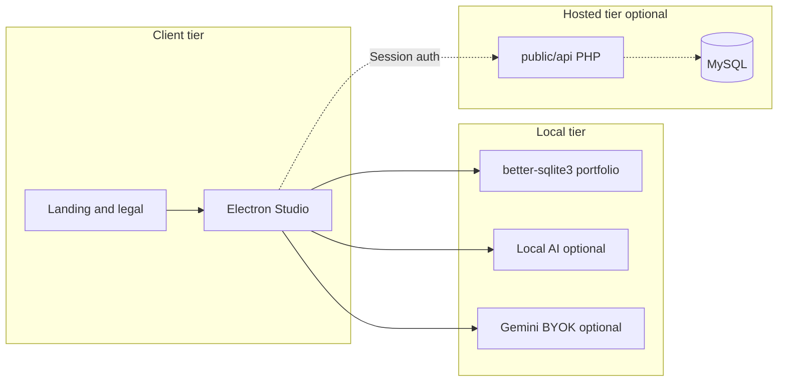
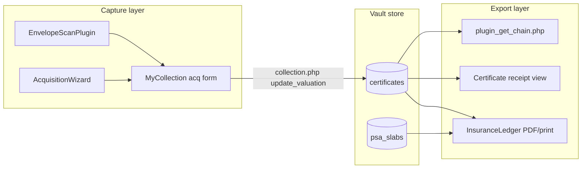
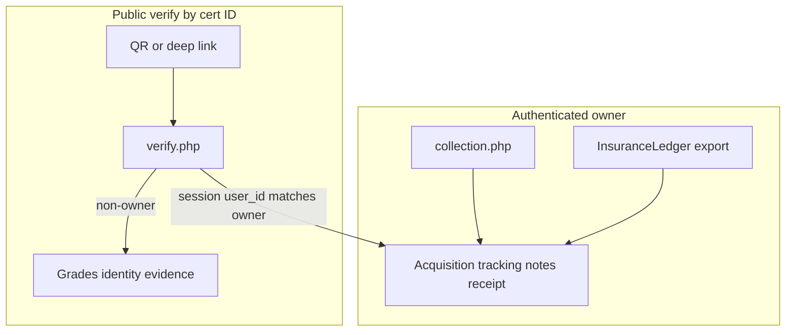
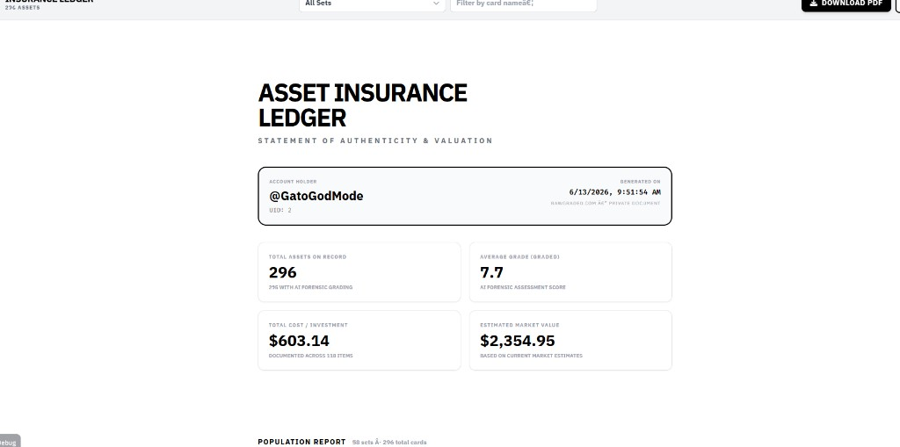
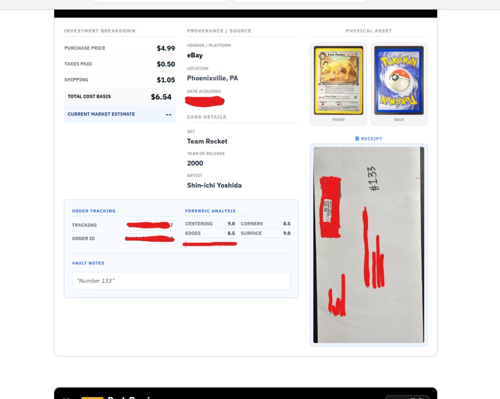
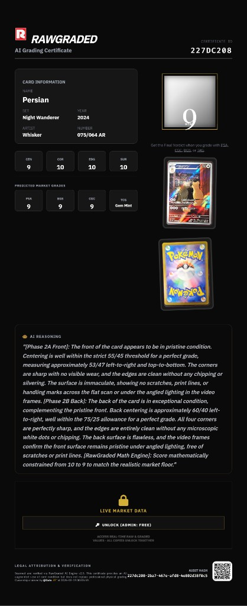
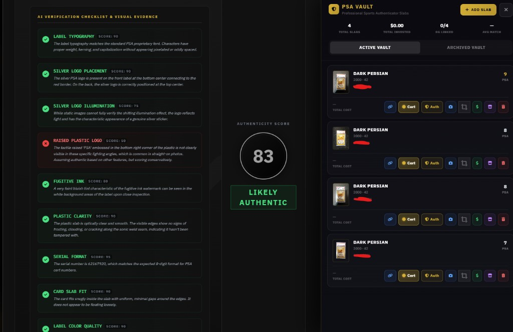
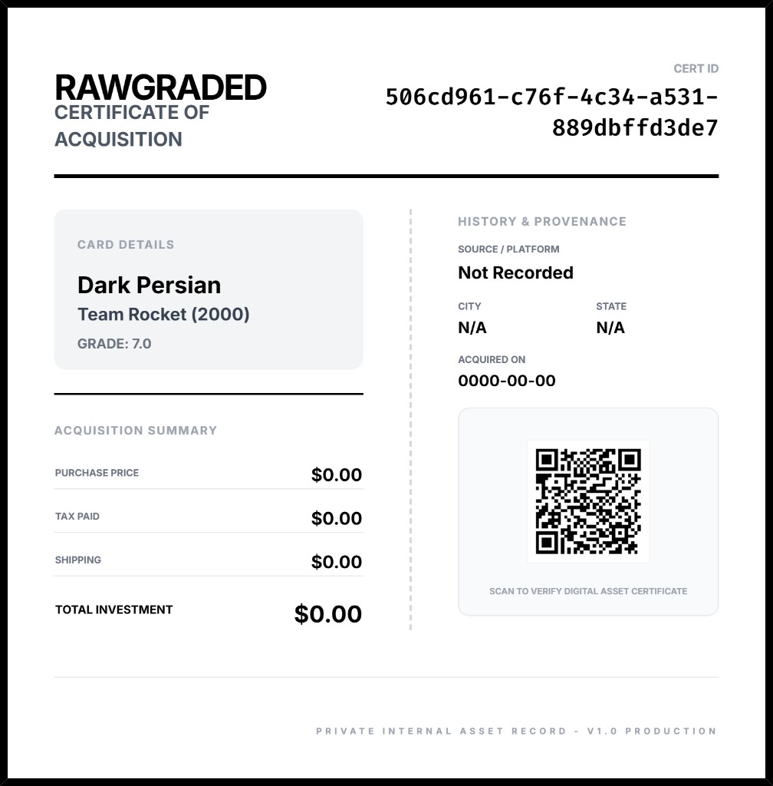

<div align="center">

# RawGraded Studio

**Local-first TCG pre-grading — capture, centering, forensics, AI evidence passes, deterministic grade math, certificates, and portfolio tracking.**

[](LICENSE)
[](https://www.electronjs.org/)
[](https://react.dev/)
[](https://github.com/GatoGodMode)

[rawgraded.com](https://rawgraded.com) · **Public assurance repository** — architecture reference for security and engineering review

</div>

---

## Why this exists

Submitting a card to PSA/BGS/CGC costs real money with weeks of turnaround. RawGraded Studio lets collectors **pre-grade on their own machine** — guided capture, PSA-style centering, optional multi-stage video forensics, local or BYOK cloud AI, and deterministic grade math before paying submission fees.

This repository is a **deliberately scoped public source publication**: application logic, API control patterns, and client security boundaries suitable for third-party review. **Production artifacts** (binaries, operator credentials, schema migration tooling, and release automation) are distributed through [rawgraded.com](https://rawgraded.com) and private release channels — not through this tree.

**Created by:** [Joseph Edwards (@GatoGodMode)](https://github.com/GatoGodMode) · MIT licensed

---

## Security posture at a glance

| Principle | Implementation |
|---|---|
| **Least privilege** | Authenticated session required for mutating API actions and secret retrieval; admin role for operator settings |
| **Secrets out of source** | Third-party keys (Gemini, Stripe, PSA, market data) loaded from runtime settings — never embedded in PHP/TS |
| **Local-first default** | Card imagery and portfolio SQLite remain on-device unless the user opts into vault sync |
| **Defense in depth** | bcrypt credentials, optional TOTP, Stripe webhook HMAC, CORS allowlist, marketplace DB isolation |
| **Publication boundary** | This repo is source reference only; configuration and migration surfaces return `403` by design |
| **Release integrity** | [`scripts/publish-preflight.cjs`](scripts/publish-preflight.cjs) enforces artifact policy before any public push |

---

## Threat model and trust boundaries

```mermaid
flowchart TB
  subgraph untrusted [Untrusted]
    Browser[Browser client]
    Attacker[Network adversary]
  end
  subgraph trustDesktop [User device trust zone]
    Electron[Electron main + preload IPC]
    SQLite[(Portfolio SQLite)]
    Ollama[Loopback Ollama optional]
  end
  subgraph trustHosted [Operator trust zone]
    PHP[PHP vault API]
    MySQL[(MySQL)]
    Settings[(Runtime settings store)]
  end
  Browser --> Electron
  Electron --> SQLite
  Electron --> Ollama
  Browser -.->|HTTPS session auth| PHP
  PHP --> MySQL
  PHP --> Settings
  Attacker -.x->|No direct DB or settings access| MySQL
```

**Assumptions**

- Attackers may read this repository, fuzz public endpoints, and attempt credential stuffing or webhook replay.
- Operators control hosted infrastructure, TLS termination, and MySQL hardening outside this codebase.
- Desktop users are trusted on their own machine; the Electron IPC boundary prevents renderer direct filesystem access.

**Non-goals of this publication**

- This tree is not a bootstrappable deployment package, migration kit, or secret store.
- Reviewers should treat absent release tooling as an intentional publication control, not an oversight.

---

## Data classification

| Class | Examples | Where it lives | In this repo |
|---|---|---|---|
| **Public reference** | React/Electron UI, PHP endpoint logic, grading math | GitHub | Yes |
| **Operator confidential** | `config.php`, DB credentials, signing material | Private deploy | No |
| **User confidential** | Card images, portfolio rows, draft scans | Device and/or MySQL | Logic only |
| **Payment confidential** | Stripe secret + webhook signing keys | Settings table | Retrieval gated |

---

## Architecture



### Repository map

| Path | Role |
|---|---|
| [`desktop/`](desktop/) | Grading wizard and portfolio applications |
| [`electron/`](electron/) | Main process, preload IPC, on-device SQLite |
| [`components/`](components/) | Capture, centering, forensics, vault plugins, certificates |
| [`services/grading/`](services/grading/) | Deterministic grade math and consistency guards |
| [`services/llm/`](services/llm/) | Gemini BYOK vs local Ollama orchestration |
| [`public/api/`](public/api/) | Hosted vault API — auth, certificates, credits, Stripe, plugins |
| [`scripts/publish-preflight.cjs`](scripts/publish-preflight.cjs) | Pre-push policy gate |
| [`EnVars/SysMap.xml`](EnVars/SysMap.xml) | Structural index for reviewers |

---

## Security controls

### Desktop client

| Control | Mechanism |
|---|---|
| **Data residency** | Portfolio DB under Electron `userData`; session images stay in-process unless exported |
| **IPC minimization** | Preload exposes scoped APIs; main process owns filesystem and SQLite ([`electron/ipc/portfolioDb.ts`](electron/ipc/portfolioDb.ts)) |
| **BYOK cloud AI** | Gemini keys supplied at runtime via settings — not compiled into bundles |
| **Offline path** | Full grading workflow operable without vault account |

### Hosted API ([`public/api/`](public/api/))

| Control | Mechanism |
|---|---|
| **Authentication** | PHP sessions; [`requireAuth()`](public/api/db.php) / [`requireAdmin()`](public/api/db.php) on sensitive routes |
| **Credential storage** | [`password_hash()`](public/api/auth.php) / `password_verify()` for users and admins |
| **MFA** | TOTP with HMAC-signed HttpOnly cookies ([`totp_helper.php`](public/api/totp_helper.php)) |
| **Secret retrieval** | [`settings_util.php`](public/api/settings_util.php) + admin/session gates on [`settings.php`](public/api/settings.php) |
| **Transport policy** | CORS allowlist on production origins ([`db.php`](public/api/db.php)) |
| **Tenancy** | Certificate mutations enforce `user_id` match or admin override |
| **Payments** | Stripe webhook HMAC via [`stripe_webhook_util.php`](public/api/stripe_webhook_util.php) before fulfillment |
| **Marketplace isolation** | Separate DB connection — [`openMarketplaceConnection()`](public/api/db.php) |

### Runtime secret inventory (hosted)

Secrets are **names in settings**, not values in git. Production operators configure via Admin:

| Setting key | Purpose |
|---|---|
| `gemini_api_key` | Cloud AI inference |
| `psa_public_api_key` | PSA cert lookup |
| `POKEPRICE_API_KEY` / `POKEWALLET_API_KEY` | Market data bridges |
| `cardhedger_api_key` | CardHedger lookup |
| `REMOVEBG_API_KEY` | Background removal (admin fetch only) |
| `stripe_*` | Checkout and webhook verification |

---

## Release integrity

Public pushes are expected to pass an automated policy scan:

```bash
node scripts/publish-preflight.cjs
```

The gate rejects credentials, private keys, environment files, database dumps, and other artifacts that violate the publication boundary defined for this repository. Treat a failing preflight as a **merge blocker**, not a warning.

---

## Product capabilities

| Layer | Capability |
|---|---|
| **Desktop Studio** | Electron + React grading workflow through certificate export |
| **Local AI** | Ollama loopback and/or Gemini BYOK |
| **Grade math** | Deterministic engine — evidence → computed grades, not LLM-only output |
| **Hosted vault** | Optional PHP API: auth, membership, archive, plugins, Stripe |
| **Marketing** | RAW ENGINE landing, download pages, legal/privacy |

---

## Vault records: provenance, capture, and indemnity documentation

The **hosted vault web application** ([`App.tsx`](App.tsx) grading flow + [`components/MyCollection.tsx`](components/MyCollection.tsx) collection UI) maintains structured asset lifecycle records: cost basis, source lineage, physical evidence, and exportable statements for collectors, resale counterparties, and third-party coverage review. This is distinct from the Electron local portfolio. RawGraded is **not** an insurer or grading authority — ledger output is documentation for underwriter review, not a policy.



### Provenance capture

| Concern | Implementation |
|---|---|
| **Acquisition schema** | 11+ persisted fields per certificate: `acq_price`, `acq_tax`, `acq_shipping`, `acq_date`, `acq_source`, `acq_city`, `acq_state`, `tracking_number`, `order_id`, `vault_copy`, `user_notes`, optional `envelope_receipt_img` — via [`public/api/collection.php`](public/api/collection.php) `update_valuation` and [`public/api/save.php`](public/api/save.php) |
| **Structured entry UX** | [`components/AcquisitionWizard.tsx`](components/AcquisitionWizard.tsx) — retailer/pack catalogs, per-user presets, tax/shipping allocation, tracking + order ID |
| **Lineage / copies** | `parent_id` linking with acquisition carry-over ([`collection.php`](public/api/collection.php) `update_parent`); chain traversal with cycle guard ([`public/api/plugin_get_chain.php`](public/api/plugin_get_chain.php)); stats dedupe so linked copies are not double-counted |
| **Audit trail** | `name_history` JSON rendered in ledger as **Asset Audit Trail** ([`components/InsuranceLedger.tsx`](components/InsuranceLedger.tsx)) |
| **Per-asset receipt** | Certificate internal record — investment breakdown, provenance block, forensic defect crops, QR to public cert ([`components/Certificate.tsx`](components/Certificate.tsx)) |
| **Slab provenance** | PSA vault plugin stores parallel acquisition fields + controlled transfer workflow ([`public/api/plugin_psa_vault.php`](public/api/plugin_psa_vault.php)) |

### Envelope and receipt scanner

Isolated OCR plugin — [`components/EnvelopeScanPlugin.tsx`](components/EnvelopeScanPlugin.tsx) + [`services/geminiService.ts`](services/geminiService.ts) (`extractEnvelopeData`):

| Control | Detail |
|---|---|
| **Pipeline isolation** | Standalone from grading; failures return `{}` and never block the scan workflow |
| **Pro-gated** | Membership feature; does not consume grading credits |
| **Payload discipline** | Client resizes to 768px before inference; structured JSON (city, state, tracking, orderId, source, price, cardCount) |
| **Origin-first extraction** | Prompt prioritizes sender/store over destination — provenance-relevant metadata, reduced buyer-address capture |
| **Opt-in evidence retention** | “Save Image to Insurance Ledger” checkbox; receipt image persisted only when user enables (default off for users) |
| **Marketplace heuristics** | eBay `ESUS` tracking prefix normalization in [`App.tsx`](App.tsx) handler |

### Insurance ledger

Portfolio-grade export — [`components/InsuranceLedger.tsx`](components/InsuranceLedger.tsx):

| Capability | Detail |
|---|---|
| **Coverage scope** | Includes hidden vault records (still owned assets); excludes archived; merges active PSA slabs |
| **Per-asset dossier** | Cost basis, provenance/source, order tracking IDs, forensic subgrades + defect count, front/back imagery, optional receipt, cert ID |
| **Portfolio analytics** | Collection totals; population report by set/card with cost basis aggregation |
| **Export surfaces** | Sectioned PDF (`jsPDF` + `html2canvas`) and print-optimized layout with isolated print CSS |
| **Market data boundary** | `resolveMarketValue()` uses unlocked market JSON only when key is in `unlockedMarketKeys`; otherwise falls back to estimated value |
| **Statement framing** | Cover title “Statement of Authenticity & Valuation” — documentation for coverage review, not insurance issuance |

### PII, SPII, and data-leak controls

Vault-records data is classified at capture and enforced at the API layer — not by UI hiding alone.

#### Data taxonomy

| Class | Fields | Exposure default |
|---|---|---|
| **Public verification** | Cert ID, card identity, grades, defect evidence, scan date, public username | Anyone with cert link / QR |
| **Owner-only SPII** | `acq_price`, `acq_tax`, `acq_shipping`, `acq_date`, `acq_source`, `acq_city`, `acq_state` | Authenticated owner only |
| **Owner-only PII / transaction SPII** | `tracking_number`, `order_id`, `user_notes`, `envelope_receipt_img` | Owner only; receipt image **opt-in** at capture |
| **Financial SPII (gated)** | `market_price_json`, unlocked tier pricing in ledger exports | Owner + explicit market unlock |

#### Primary anti-leak gate

Public cert verification is available by ID (QR/deep link), but acquisition and transaction SPII is **stripped server-side** in [`public/api/verify.php`](public/api/verify.php) when the requester is not the cert owner:

```php
// Non-owners never receive:
unset($cert['acq_price'], $cert['acq_tax'], $cert['acq_shipping'], ...);
unset($cert['tracking_number'], $cert['order_id'], $cert['user_notes'], $cert['envelope_receipt_img']);
```

Provenance chain history for public viewers returns only non-sensitive lineage fields (`id`, `name`, `overall_grade`, `estimated_value`, `date_scanned`) — not acquisition columns.

#### Leak-prevention controls

| Risk | Mitigation |
|---|---|
| **Cross-tenant collection access** | [`collection.php`](public/api/collection.php) — `require_active_platform_membership()`; non-admins blocked from another user's `user_id` |
| **Cross-tenant image exfiltration** | `serve_image` — `WHERE id = ? AND user_id = ?` |
| **Cross-tenant chain traversal** | [`plugin_get_chain.php`](public/api/plugin_get_chain.php) — `WHERE id = ? AND (user_id = ? OR admin)` |
| **Public verify SPII exposure** | Server-side unset in `verify.php` (above); `is_hidden` removes certs from public listings while owner retains full access |
| **Receipt over-collection** | OCR extracts structured fields only; full image persisted only when user checks “Save Image to Insurance Ledger” |
| **OCR destination-address exposure** | Origin-first prompt in `extractEnvelopeData` — reduces capture of buyer home addresses from shipping labels |
| **OCR pipeline blast radius** | Isolated from grading; failures return `{}` — no partial SPII on error paths |
| **Ledger export scope creep** | Owner-initiated modal only; `resolveMarketValue()` respects `unlockedMarketKeys` |
| **Custody transfer SPII bleed** | PSA slab transfers — pending/resolve workflow under owner tenancy ([`plugin_psa_vault.php`](public/api/plugin_psa_vault.php)) |
| **Privacy mode bulk shield** | [`privacy.php`](public/api/privacy.php) — global `privacy_mode` toggles `is_hidden`; per-cert and bulk hide endpoints |



**Reviewer note:** SPII is stored for owner documentation and export; it is not published through public verification endpoints. Insurance ledger PDFs are user-generated artifacts — treat shared exports like any exported financial document.

### Vault records — security enforcement

| Control | Where |
|---|---|
| Session + membership gate | [`collection.php`](public/api/collection.php) — `require_active_platform_membership()` |
| Tenancy on all mutations | `WHERE id = ? AND user_id = ?` on acquisition updates, image serve, parent linking |
| Cross-user access denied | Non-admins cannot request another `user_id`; admin role override only |
| Privacy layering | [`privacy.php`](public/api/privacy.php) — global `privacy_mode`, per-cert `is_hidden` (hidden ≠ excluded from owner ledger) |
| SPII strip on public verify | [`verify.php`](public/api/verify.php) — server-side unset for non-owners |
| Chain API hardening | Auth required; `visitedIds` loop guard; admin-only cross-tenant read |
| Prepared statements | All acquisition and chain queries parameterized |

### Vault records — source map

| Component | Path |
|---|---|
| Collection + acquisition API | [`public/api/collection.php`](public/api/collection.php) |
| Provenance chain API | [`public/api/plugin_get_chain.php`](public/api/plugin_get_chain.php) |
| Public verify + SPII gate | [`public/api/verify.php`](public/api/verify.php) |
| Envelope OCR plugin | [`components/EnvelopeScanPlugin.tsx`](components/EnvelopeScanPlugin.tsx) |
| OCR service (isolated) | [`services/geminiService.ts`](services/geminiService.ts) |
| Acquisition wizard | [`components/AcquisitionWizard.tsx`](components/AcquisitionWizard.tsx) |
| Collection UI | [`components/MyCollection.tsx`](components/MyCollection.tsx) |
| Insurance ledger | [`components/InsuranceLedger.tsx`](components/InsuranceLedger.tsx) |
| Privacy controls | [`public/api/privacy.php`](public/api/privacy.php) |

---

## Platform showcase

Production UI surfaces for reviewers — scale, data governance, and engineering depth. Screenshots are from live vault data with SPII redacted where shown.

<details>
<summary><strong>At scale</strong> — portfolio-grade PDF export over large collections</summary>

<br>



- Sectioned export via `data-pdf-section` chunks — [`components/InsuranceLedger.tsx`](components/InsuranceLedger.tsx)
- Progress UI during multi-page PDF assembly (`jsPDF` + `html2canvas`)
- Tested against **250+ asset** portfolios without blocking the main thread

</details>

<details>
<summary><strong>Trust by design</strong> — SPII boundaries in the product surface</summary>

<br>




- Per-asset dossier: cost basis, provenance, forensic subgrades, optional receipt evidence
- **GO PRIVATE** — global archive visibility control ([`privacy.php`](public/api/privacy.php))
- Public cert verify strips acquisition SPII server-side ([`verify.php`](public/api/verify.php)) — visuals match documented controls above

</details>

<details>
<summary><strong>Engineering surface</strong> — audit trail, anti-fraud, 3D viewer</summary>

<br>






- Deterministic math trace + audit hash on certificates — not LLM-only grades
- Slab authenticity CV checklist ([`plugin_slab_checker.php`](public/api/plugin_slab_checker.php))
- Three.js holo viewer with height-grid pipeline — [`components/Card3DViewer.tsx`](components/Card3DViewer.tsx)

</details>

<details>
<summary><strong>Acquisition record</strong> — certificate of acquisition export</summary>

<br>



- Internal asset record tied to vault cert ID — [`components/Certificate.tsx`](components/Certificate.tsx)

</details>

---

## Data flows

### Local portfolio

- **DB path:** `%AppData%/studio-portfolio/portfolio.db` — WAL-mode SQLite ([`electron/ipc/portfolioDb.ts`](electron/ipc/portfolioDb.ts))
- **Preferences:** `electron-store` for provider choice and BYOK keys — device-local
- **Images:** Session-scoped during grading; exported via [`services/export/`](services/export/)

### Hosted vault (when enabled)

| Store | Purpose |
|---|---|
| **`rawgraded`** | Users, certificates, drafts, AI jobs, settings, membership |
| **`marketplace`** | Optional listing bridge — isolated credentials |

Credit queueing, Stripe fulfillment, and certificate lifecycle are implemented in [`public/api/ai.php`](public/api/ai.php), [`public/api/save.php`](public/api/save.php), and [`public/api/stripe.php`](public/api/stripe.php).

---

## Grading pipeline (summary)

Deterministic grading combines **guided capture**, **LLM evidence extraction**, and **rules-based math** ([`services/grading/gradingMathEngine.ts`](services/grading/gradingMathEngine.ts)). The LLM catalogs defects; the math engine assigns subgrades and PSA/BGS/CGC predictions with an auditable `mathTrace`.

Wizard steps: capture → crop → centering → optional video forensics → analysis → results → certificate ([`desktop/StudioApp.tsx`](desktop/StudioApp.tsx)).

Slab authenticity checks ([`services/slabAuthenticityRules.ts`](services/slabAuthenticityRules.ts)) are a separate track from raw-card pre-grading.

---

## Third-party trademarks

RawGraded is not affiliated with or endorsed by Pokémon, Nintendo, GAMEFREAK, Creatures Inc., PSA, BGS, Beckett, CGC, TAG, eBay, TCGplayer, GemRate, Google, Stripe, or other third parties. Names and logos are used for identification only. Pre-grading output is **not** an official grade from any grading company.

---

## License

MIT — see [LICENSE](LICENSE).
